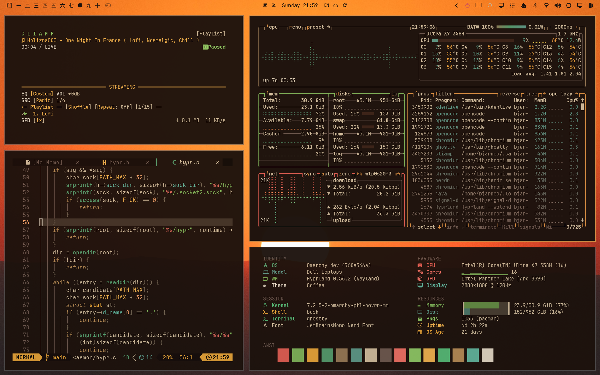

# Sunset

A dark, mid-century sunset theme for [Omarchy Quattro](https://github.com/basecamp/omarchy).

Espresso backgrounds, cream text, and amber accents. Brick red, mustard,
avocado, sage, and walnut carry the palette. The palette keeps the shade ramp
of Evergreen.



## Installation

```bash
omarchy theme install https://github.com/bjarneo/omarchy-sunset-theme
```

## Backgrounds

Eleven wallpapers up to 6016x3384 and one seamless retro sunset loop at
3840x2160.

## Credits

Based on Evergreen by [@iamdothash](https://x.com/iamdothash).

Wallpapers and video from [Pexels](https://www.pexels.com).
